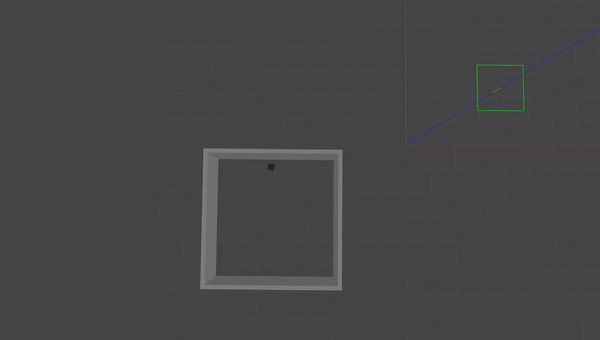
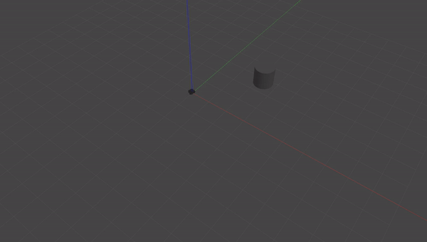

# Warmup Project (Jason Lin, linj24)

## Driving in a Square
### Approach
The goal here is to get the robot to move forward for a set amount of time, then turn for a set amount of time. Since a square has equal side lengths and equal angles, we can accomplish this by looping through the same code four times:
```
- Move forward
- Stop
- Rotate 90 degrees
- Stop
```
To avoid slipping, I've set up the move commands to accelerate the robot rather than sending a single velocity command. Sadly, there still seems to be a bit of slipping, but that can't be helped with the timing approach.

### Code Structure
I've organized my code into a class, with movement commands set up as methods. All of these methods publish to the `/cmd_vel` topic so that the `run` method isn't too cluttered.
The `move_forward` command sets the linear velocity of the robot, and the `accelerate` command, which adds to the linear velocity of the robot.
The `stop` command sets both the linear and angular velocity of the robot to 0.
The `turn_left` command sets the angular velocity of the robot; I don't have a corresponding acclerate command here because I figured that the rate would be slow enough to avoid slipping.

I time my commands by using a counter named `ticks`, which breaks up the length of a single loop into 100 units. I'm using `rospy.Rate(5)`, so 100 ticks corresponds to 20 seconds, which is the length of my loop.
Right now, I have the robot set to:
- Stop at tick 0
- Accelerate from tick 10 to tick 35
- Decelerate from tick 36 to tick 60
- Stop at tick 0
- Begin turning left at tick 75
- Stop at tick 100 (start of loop)

### Demonstration


## Wall Follower
### Approach
The goal here is to get the robot within some distance of a wall, turn it so that its x-axis is parallel with it, move until it detects another wall, then switch the robot's focus to the second wall. I imagine that switching the robot's focus to the second wall can be done by keeping track of which side the original wall was on and rotating away from it. I envision this working using the following algorithm.

- Move forward (scale velocity with minimum scan value)
- If the robot's minimum scan value is X (+- some error)
- If the minimum scan angle is in front of the robot
--- Hard rotation in the direction of the last wall (right by default)
- Else if the minimum scan angle is to the left of the robot
--- Rotate in the direction that minimizes the 90-degree scan value while approaching a fixed distance from the wall
- Else if the minimum scan angle is to the right of the robot
--- Rotate in the direction that minimizes the 270-degree scan value while approaching a fixed distance from the wall
- Loop the above

### Code Structure
Once again, my code is in a class, but there is only one function since nothing is time-dependent and nothing needs to be looped. That function, `check_distance`, is the callback function for the scan topic. It makes use of five constants: the proportional coefficients for linear/angular velocity, the angular velocity for turning corners, the distance from the wall to be maintained, and a conversion from distance to angle to steer the robot toward that distance.

The first branch of the main if statement checks to see if the closest wall is in front of the robot. This will occur if the robot reaches a corner or if this is the first wall that the bot hits after initialization. In this situation, the robot's linear velocity is set to zero and its angular velocity is set to the predetermined value; this will give the robot enough momentum to turn the corner without using a timer. The direction of the turn is determined by the last wall that the bot was able to detect; if no walls were detected, the bot will turn right by default.

The other two branches give the robot an angular velocity to course-correct it to travel at a fixed distance from the wall. This is especially important after making turns, as the bot will be significantly closer to the wall than it should be.

### Demonstration



## Person Follower
### Approach
The goal here is for the robot to move in the direction of the closest object. This makes the algorithm I intend to use fairly simple.

- Rotate toward the minimum scan value
- Move forward at a velocity proportional to the distance from the object

The use of proportional control will allow me to smoothly lower the bot's velocity as it approaches a safe distance from the wall, avoiding a crash.

### Code Structure
Once again, my code is in a class, but there is only one function since nothing is time-dependent and nothing needs to be looped. That function, `check_distance`, is the callback function for the scan topic. It makes use of five constants: the proportional coefficients for linear/angular velocity, the angular velocity for turning corners, the designated safe distance from the object, and a maximum distance to start following the object at.

The function first checks to see if the bot is within the maximum distance to follow the object; if it is, then it rotates in the direction of the object. Once the object is within the front 180 degrees of the bot, the bot will begin moving forward at a rate proportional to the distance from the object. The designated safe distance corresponds to a linear velocity of zero.

### Demonstration


## Challenges
Most of the challenges I faced during this project involved dealing with noise and momentum. After I had laid out my initial code, I spent a considerable amount of time adjusting my five constants for the second and third behaviors in order to ensure that overturning wasn't an issue. However, the algorithm design itself wasn't too difficult once we learned about proportional control.

## Future Work
I imagine I could improve my wall-following behavior by allowing the bot to anticipate a corner before it reaches it, avoiding the current situation where the robot drifts toward the wall while turning. However, I wanted to keep the behavior as simple as possible this time around, so I gave up on trying to implement it. I would only make minor tweaks to the other two behaviors by adjusting the timing and constants, not significant changes to the algorithm.

## Takeaways
* Timing is unreliable when you need to take noise into account.
	* Much like a driver needs to anticipate hazards on the road, a robot must anticipate deviations from its intended path. Predetermined behaviors do not allow for real-time correction.
* Conversely, proportional control is effective at handling both noise and momentum.
	* This ties into the previous point, as proportional control uses sensors.
* Avoid loops if possible.
	* Loops indicate that you'll be doing some sort of timed operation. This means that they're unreliable.
