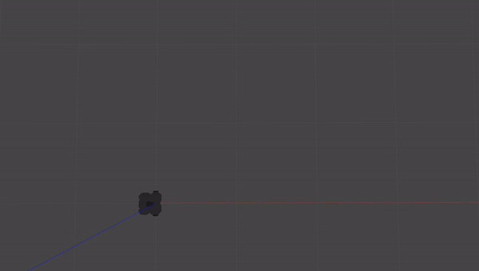

# Warmup Project (Jason Lin, linj24)

## Driving in a Square
### Approach
The goal here is to get the robot to move forward for a set amount of time, then turn for a set amount of time. Since a square has equal side lengths and equal angles, we can accomplish this by looping through the same code four times:
```
- Move forward
- Stop
- Rotate 90 degrees
- Stop
```
To avoid slipping, I've set up the move commands to accelerate the robot rather than sending a single velocity command. Sadly, there still seems to be a bit of slipping, but that can't be helped with the timing approach.

### Code Structure
I've organized my code into a class, with movement commands set up as methods. All of these methods publish to the `/cmd_vel` topic so that the `run` method isn't too cluttered.
The `move_forward` command sets the linear velocity of the robot, and the `accelerate` command, which adds to the linear velocity of the robot.
The `stop` command sets both the linear and angular velocity of the robot to 0.
The `turn_left` command sets the angular velocity of the robot; I don't have a corresponding acclerate command here because I figured that the rate would be slow enough to avoid slipping.

I time my commands by using a counter named `ticks`, which breaks up the length of a single loop into 100 units. I'm using `rospy.Rate(5)`, so 100 ticks corresponds to 20 seconds, which is the length of my loop.
Right now, I have the robot set to:
- Stop at tick 0
- Accelerate from tick 10 to tick 35
- Decelerate from tick 36 to tick 60
- Stop at tick 0
- Begin turning left at tick 75
- Stop at tick 100 (start of loop)

### Demonstration



## Wall Follower
### Approach
The goal here is to get the robot within some distance of a wall, turn it so that its x-axis is parallel with it, move until it detects another wall, then switch the robot's focus to the second wall. I imagine that switching the robot's focus to the second wall can be done by keeping track of which side the original wall was on and rotating away from it. I envision this working using the following algorithm.

- Move forward
- If the robot's minimum scan value is X (+- some error)
--- Set velocity to 0
- If the scan value at 90 is less than the scan value at 270
--- Rotate left
- Else
--- Rotate right
- If one of the scan values at 90 or 270 is a minimum
--- Set angular velocity to 0
- Loop the above


## Person Follower
### Approach
The goal here is for the robot to move in the direction of the closest object. 

